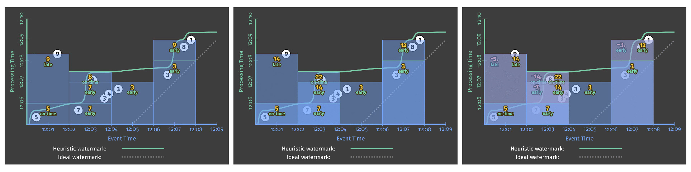

# 102

关注无限数据基于事件时间的窗口化流式处理，给出强大的无限数据处理所需的核心原则和概念，以及支持时间计算的机制。这将让流式计算超越经典的批处理。

## 概念

* 水印 watermarks：基于事件发生的时间判断输入完整性。如果当前水印是 10 点，那么「所有的 10 点之前的数据都已经被处理了」，因此水印被用来衡量无限数据处理的进度。
* 触发器 triggers：一种描述窗口内的数据何时被处理且下发的机制。触发器这个机制使得我们能灵活地选择何时计算窗口数据，还能多次触发一个窗口。进一步，这使得我们可以随着时间的推进，用新的或者迟到的数据来修订之前推测的结果。
* 累积 accumulation：指定在同一个窗口中多个计算结果之间的关系。这些结果可能完全无关的，比如随着时间的推移表示独立的增量，或者它们之间可能存在重叠。不同的累积模式有不同的语义和成本，可以根据场景选择。

## 4 个对处理无限数据至关重要的问题

1. 计算的结果是什么？What results are calculated?

    这些数据转换包括流加和、计算直方图、训练机器学习用的模型、等等

2. 数据在哪里（哪个窗口）做计算？Where in event time are results calculated?

    如果按照事件时间的角度切割数据，这条数据在哪里得到计算。

3. 什么时候（在处理时间）做计算？When in processing time are results meterialized?

    通过使用**水印**和**触发器**就可以回答什么时候做计算。做计算的条件有各种各样，最常用的是标志输入数据源完整性的水印。触发器允许产出推测性的结果（比如水印结束前提前触发计算降低延迟），并且允许处理启发式水印带来的迟到数据。

4. 结果如何被修正？How do refinements of results related?

    常用的累积类型包括：

    1. 丢弃：结果都是独立且不同的
    2. 累积：后面的结果建立在先前的结果上
    3. 累积回收：回收之前的结果发送出新的累积值

## What：数据转换/计算的结果是什么

转换类型：

一个批处理的示例，计算 10 个键值对的整数值的和。一个真实的案例是把所有组员的个人成绩加起来得到一个组的整体得分。

<video controls class="video-wrapper">
    <source src="/stream-process/resources/video/Figure 02   classic batch.webm" type="video/webm">
</video>

动画从 2 个维度绘制输入和输出：

* 事件时间 X 轴
* 处理时间 Y 轴

批处理会累积状态，直到看到所有输入，然后产生单个输出。

如果要处理无限数据，这样的处理是不够的，我们无法等所有的数据都到了才计算，因此我们需要使用窗口，这也回答了数据在哪里计算。

## Where：窗口/数据在哪里计算

批处理通过 2 分钟固定窗口做整数求和的例子，和之前没有窗口的例子一样，每条收到的数据被积累在状态中，直到所有的数据都被收到，这样我们就有了 4 个结果，每一对应一个 2 分钟的事件窗口。

<video controls class="video-wrapper">
    <source src="/stream-process/resources/video/Figure 04   batch fixed.webm" type="video/webm">
</video>

相比与批量计算引擎做窗口计算，我们更希望能够自然地处理无界数据，低延迟地获得每个窗口的计算结果。

我们之前提过，基于事件时间的窗口划分需要解决的一个问题就是「窗口完整性」，即如何确定已经得到划分窗口的所有数据？

## When：水印/描述输入完整性

水印在事件时域中描述输入完整性，它是系统在面对无界或者有界的数据流（在无界的场景下更有用），描述进度和完整性的方式。

红色的实际中的线就是水印，它随着处理时间的推移捕获事件时间完整性的进度。

可以将水印视为一个函数 	`F(P) -> E`，对应处理时间中的一个点在事件时间中返回一个点。更准确地说，函数的输入是这个时间点上每个上游的状态，包括：输入、缓存的数据、正在被处理的数据等等。事件时间中的那个点 `E` 是系统认为所有 `E` 之前的数据都被处理过了，换句话说，这是一个断言，不会再看到事件时间小于 `E` 的数据。

例如：基于事件发生的时间判断输入的完整性，如果说当前水印是 10 点，那么「所有的 10 点前的数据都已经被处理了」，因此水印被用来衡量无限数据处理的进度。

* 完美的水印（Perfect watermarks）：在我们对所有输入数据有准确了解的情况下，可以构建完美的水印，在这种情况下，没有迟到的数据。例如：
    1. 非乱序事件流，最近一次事件的时间戳就是完美的水印。
    2. 如果知道事件的迟到时间不会超过 5 秒，就可以将水印标记时间设为收到的最大时间戳减去 5 秒。
* 启发式水印（Heuristic watermarks）：对于许多分布式输入源，拥有完备准确的输入数据知识是不切实际的，在这种情况下，最佳选择是提供启发式的水印。这种水印在其预测中可以非常准确。但也有其问题：
    1. 启发式的水印意味着它有时可能是错误的，这将导致迟到的数据晚于水印出现。
    2. 水印推断范围太大，收到结果的速度可能就会很慢，解决方法是在水印到达之前输出近似结果

<video controls class="video-wrapper">
    <source src="/stream-process/resources/video/Figure 06   streaming wm joint.webm" type="video/webm">
</video>

准确水印（左）和启发式水印（右）的固定窗口整数求和计算。

水印经过窗口结束端时，窗口被计算输出。区别在于右侧基于启发式水印的计算未考虑迟到的数据 9。

同时，这个例子也展示了水印的 2 个缺点（以及任何其他完整性概念）：

* **太慢**：当水印是计算的唯一的触发条件，由于已知的未处理数据而导致任何类型的水印被正确的延迟时，会直接导致结果输出延迟。
* **太快了**：当启发式的水印错误地提前了，可能导致数据迟到。这会导致窗口提早结束，输出正确的结果。

## When：触发器/解决水印的缺点

触发器决定了窗口的输出应该在处理时间的什么时候发生。

被用作触发器的信号包括了：

* 水印进度（Watermark progress）：水印通过窗口结束端时产生输出，就是水印进度触发的隐式版本。另一个用例是当窗口的生命周期超过一些有用的范围时触发垃圾收集。
* 处理时间进度（Processing time progress）：这对于提供有规律的定期的更新很有用，因为处理时间总是均匀且无延迟地进行。
* 数据计数（Element count）：用于在窗口中观察到有限数量的数据后触发
* 结束符号（Punctuations）：依赖于数据的某些特征触（例如：EOF 元素或刷新时间）发。

在这些简单的触发器之外，还有一些组合触发器用来更复杂的触发条件，包括：

* 重复（Repetitions）：与处理时间结合使用特别有用，可以提供规律的定期的更新
* 与（conjunctions）：仅在所有子触发器被触发时触发（例如：在水印通过窗口结束并且收到终止标点符号记录后）
* 或（disjunctions）：在任何子触发器被触发时触发（例如：在水印通过窗口结束或者收到终止标点符号记录后）
* 序列（sequences）：以预定义的顺序触发子触发器

现在我们看怎么通过触发器解决水印太慢或者太快的问题。在这 2 种情况下，我们基本上都希望在水印超过窗口结束之前或者之后，做一些规律的计算。

<video controls class="video-wrapper">
    <source src="/stream-process/resources/video/Figure 07   streaming speculative late joint.webm" type="video/webm">
</video>

### 解决水印太慢的问题

在太慢的情况下，可以按照处理时间提前地周期性地触发计算

### 解决水印太快的问题

在太快的情况下，假设系统使用了相对准确的启发式水印，我们不会经常看到较晚的数据，但是如果看到了，就重新计算更正结果。考虑到预期的迟到数据的频率，不太可能让系统超载。

## When：允许迟到

在准确水印的情况下，我们知道一旦水印通过它，我们将永远不会再看到窗口的数据，因此我们可以在那时删除窗口的所有状态。

在启发式水印的情况下，我们仍然需要保持一个窗口的状态一段时间来考虑迟到的数据。但到目前为止，我们的系统没有任何好的办法可以知道每个窗口需要保持多长时间状态。

在启发式水印的示例中，为了处理迟到的数据，需要在整个生命周期中保持窗口状态，这在处理无限数据源时是不切实际的，最终会耗尽有限的空间。

在实践中，任何无序处理系统都需要提供一些方法来限制它正在处理的窗口的生命周期。一个简洁干净的做法是通过在系统内定义一个允许的迟到的范围。在此范围之后到达的任何数据都会被删除。

<video controls class="video-wrapper">
    <source src="/stream-process/resources/video/Figure 08   streaming speculative late allowed lateness 1min.webm" type="video/webm">
</video>

还是刚才的示例，允许 1 分钟的延迟数据，6 在允许的迟到范围内，因此它被合并到值为 11 的更新结果中；然而 9 不在迟到的范围，所以它只能被丢弃。

## How: 累积/结果如何被更新

触发器被用来对一个窗口产生多次计算结果，那么如何更新结果？

有 3 种不同的积累模式：

1. 丢弃（Discarding）：每次输出都会丢弃状态。这意味这每次结果都是独立的。
2. 累积（Accumulating）：每次输出的状态被保持，和未来的输入被累积到现有的状态。这意味着后面的结果基于前一个结果。
3. 累积和撤回（Accumulating & retracting）：与累积模式相似，但在生成新结果时，还会撤回前一个结果。

考虑示例中第二个窗口（时间范围[12:02, 12:04]）的 3 个快照，下表显示来 3 中支持的累积模式下每个快照对应的结果是什么样的：

|                     | Discarding | Accumulating | Accumulating & Retracting |
|---------------------|------------|--------------|---------------------------|
| Pane 1: [7]         | 7          | 7            | 7                         |
| Pane 2: [3, 4]      | 7          | 14           | 14, -7                    |
| Pane 3: [8]         | 8          | 22           | 22, -14                   |
| Last Value Observed | 8          | 22           | 22                        |
| Total Sum           | 22         | 51           | 22                        |

* 丢弃：当下游消费者本身正在执行某种累积时，丢弃模式是有用的。例如，将整数发送到期望接收增量的下游，下游将相加以产生最终计数
* 累积：下游可以使用新结果覆盖以前的结果是，例如将输出存储在 HBase 这类键/值存储中时，累积模式非常有用
* 累积和撤回：当下游无法简单的用新值覆盖旧值，还需要删除旧值时

丢弃模式下的示例：

<video controls class="video-wrapper">
    <source src="/stream-process/resources/video/Figure 09   streaming speculative late discarding.webm" type="video/webm">
</video>

累积和撤回模式下的示例：

<video controls class="video-wrapper">
    <source src="/stream-process/resources/video/Figure 10   streaming speculative late retracting.webm" type="video/webm">
</video>

累积模式的并排比较：丢弃（左）、累积（中）、累积和撤回（右）

以上我们都以基于事件时间的固定窗口为例，接下来我们再看 2 种窗口：

## when/where：基于处理时间的固定窗口

2 个输入集，拥有完全相同的事件（即，相同的值，发生在相同的事件事件），但是具有不同的观察顺序（处理时间）。

第一组是我们一直作为示例的观察顺序，颜色为白色；第二组为紫色，是第一组事件在处理时间轴上移动的结果。

<video controls class="video-wrapper">
    <source src="/stream-process/resources/video/Figure 12   input toggle.webm" type="video/webm">
</video>

### 事件时间窗口

用固定的基于事件时间的窗口作用在这 2 组数上

<video controls class="video-wrapper">
    <source src="/stream-process/resources/video/Figure 13   streaming speculative late toggle joint.webm" type="video/webm">
</video>

### 基于处理时间的触发器

<video controls class="video-wrapper">
    <source src="/stream-process/resources/video/Figure 14   proc time discarding joint.webm" type="video/webm">
</video>

### 把入口时间当作事件时间划分窗口

<video controls class="video-wrapper">
    <source src="/stream-process/resources/video/Figure 15   ingress time joint.webm" type="video/webm">
</video>

## where：会话窗口

<video controls class="video-wrapper">
    <source src="/stream-process/resources/video/Figure 17   sessions.webm" type="video/webm">
</video>

