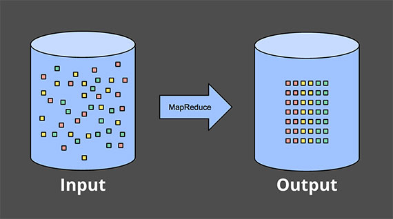
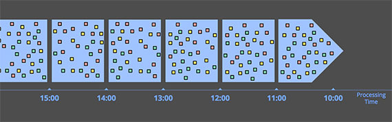

# 流式计算

## 需求

现实世界中，许多系统都会产生连续的事件，例如：

* 反映用户行为的点击流数据
* 数据中心的机器日志
* 传感器测量数据
* 金融交易
* ......

如果能够高效地分析大规模系统中的流数据，尤其是对实时数据进行实时分析，就可以借助这些数据更加清楚，快速的理解系统，理解行为，从而获取价值。

## 术语

流数据是自然产生的，我们将其定义为：

* **无限数据/无界数据（Unbounded Data）**：持续生成，且永不结束的数据。

对其进行分析的行为定义为：

* **无界数据处理（Unbounded data processing）**：持续地分析无限数据。

## 时间概念

在谈论数据处理之前，需要先明确 2 个时间概念：

1. 事件时间：事件实际发生的时间
2. 处理时间：事件被处理的事件/事件在处理系统中被观察到的时间

在现实世界中，会存在 2 个问题：

1. 事件时间与处理时间之间有偏差，而且偏差不可预测
2. 事件时间和处理时间的顺序不一致，意味着晚发生的数据可能先被系统处理


如果关心计算的正确性和事件实际发生的上下文，则必须基于事件发生的时间做计算，而不是处理时间。

带来的问题：

* 如果要求在事件时间的维度上正确地处理数据，就不能像大多数现有系统那样使用处理时间切割数据。
* 即使想按照事件时间窗口化，在无界数据的情况下，无序和时间上的偏差会带来事件时间的完整性的问题：在缺少处理时间和事件时间之间可预测映射的情况下，如何确定事件时间 X 之前的数据都到了？

## 为何需要流式处理

那么如何分析大规模系统中的流数据，我们看一下传统的批处理系统的做法：


其基本想法是：用定期运行的批处理作业来实现应用程序的持续性，数据被持续地分割为文件。

* 持续摄取数据的管道定时/定量创建一次文件（HDFS）
* 由调度程序安排批处理作业（MapReduce）分析每个新生成的文件，提供**准确但延迟**的计算结果

批处理的缺点：

* 对时间的处理方式不明确：如果需要修改计数的时间窗口，需要修改文件生成逻辑和调度逻辑，而不是应用代码逻辑
* 将数据集分批无法根据事件时间做正确的进行划分，只能根据事件处理时间进行划分
* 无法提供实时的计算结果

为了尽早获得计算结果，引入流处理作业（Storm）采集数据流，提供**低延迟，但不准确/推测**的计算结果，这就是 Lambda 架构：


Lambda 架构的缺点：

* Lambda 架构需要对同样的业务逻辑进行 2 次编程：一次为批量计算的系统，一次为流式计算的系统
* Lambda 架构需要建设、授权、运行 2 套完全独立的流水线，最后合并它们的结果，系统非常难维护
* Lambda 架构在一定程度上解决了无法获取实时结果的问题，但上述批处理的问题仍然存在

如果能打造强一致性的流式计算引擎，并且可以做到：

* **正确性/一致性**：流式计算系统需要不断地持久化（checkpoint）状态（persistent state），并且这套机制必须经过精心设计，足以在机器故障的情况下保持一致性。
* **支持面向时间的计算**：面向时间的计算是批量给不了的。源源不断从网络流过来的数据是有时间偏差的，现有的批量系统是不能处理这种时间上带来的复杂度。

就可以自然地只使用如下的流式架构解决问题：


## 数据处理模式

现在开始详细对比有限和无限数据的处理方式，主要看流式和批量如何处理这 2 种数据：

* 有界数据处理
* 无限数据 - 批量处理
* 无限数据 - 流式处理

### 有界数据



处理有界数据非常简单，上图中，左侧有限的混乱的数据集通过数据处理引擎（通常是批处理，当然设计良好的流处理引擎也可以）处理，产出相应的结构化数据。

### 无限数据 - 批量处理

批量计算引擎处理无限数据的方式，是将输入数据切割成合适大小的窗口，然后将每个窗口作为单独的有界的数据进行处理。


这种处理方式存在以下问题：

* 数据可能被「随机」地分配到错误的基于事件时间的窗口
* 不能解决更复杂的窗口策略，比如会话

会话通常被定义为一个用户的一段持续的活动，通过超过一定的时间阈值没有操作，会终结前一段会话。


例如上图，固定的将数据分批会导致会话被拆分到不同的窗口中，一种弥补的做法是扩大切割窗口的大小来减少拆分数量，但代价是延迟增加；另一种选择是添加额外的逻辑来拼接被拆分的会话，但复杂度极高。

### 无限数据 - 流式计算

与批处理通过切割成有限数据集来处理无界数据的方法不同，流式系统可以自然地处理无界数据。

在真实场景下，处理无界数据意味着：

* 在事件时间方面无序
* 事件时间偏差不可估计

具有这些特征的无限数据处理场景一般分为 4 类：

* 时间无关的计算 Time-agnostic
* 近似计算 Approximation
* 窗口计算
    * 基于处理时间的窗口计算 Windowing by processing time
    * 基于事件时间的窗口计算 Windowing by event time

#### 时间无关 Time-agnostic

时间无关的处理就是计算相关的逻辑都是数据驱动的，只要有更多的数据过来就能立即计算。

##### 过滤 filtering


过滤无界数据，从不同类型的数据集合被过滤成包含单一类型的同类集合。在任何时候都只依赖于单条数据，因此数据是否无限、是否无序、事件时间偏差都不需要考虑。

##### 內联


当从 2 个无界数据源分别收到一条数据就把它们关联起来，没有任何时间方面的考虑。例如，在看到来自一个源的数据后，简单地将其存起来，在另一个源的数据到达后，关联并产出结果。

#### 近似算法


近似算法，例如求近似的 Top-N，这类算法采用无限的输入数据并产出近似正确的结果，并不关心事件时间，而是要求数据到来后就立即处理。

#### 窗口

另外一类场景是将数据窗口化，对每个窗口内的数据分别进行处理。

窗口化就是按照时间边界把有限的或者无限的数据切割成有限的数据集，一般有 3 种不同的窗口模式：


* 固定窗口（Fixed windows）：把数据按照固定大小的时间段切割。
* 滑动窗口（Sliding windows）：固定窗口的泛化，滑动窗口由固定长度和固定步长来决定。如果步长小于长度，则窗口重叠。如果步长等于长度，则退化为固定窗口。如果步长大于长度，则可以视为采样窗口。
* 会话（Sessions）：动态窗口的典范，会话由一系列持续的事件组成，窗口之间由不活动的间隙分隔。会话窗口通常将一系列时间上相关的行为放在一起来分析用户，比如用户在网站的活跃记录。

##### 按处理时间进行窗口化（Windowing by processing time）



当按处理时间窗口化时，系统基本上将输入数据塞到当前窗口中，直到处理时间到了定义窗口的边界。例如，在 5 分钟固定窗口的情况下，系统会将数据缓冲 5 分钟，之后它会将这 5 分钟内观察到的所有数据一并处理发送打下游。

不关心事件时间，根据处理时间窗口化，因此其不用操心延迟、乱序数据带来的窗口划分、完整性判断等问题，只需要在数据到来时缓存数据，在时间到点后处理数据并发送到下游，实现非常简单。

但是其适用场景很有限：

* 完全不关心事件时间的处理场景
* 一定程度上在意事件时间，且要求基于处理时间的窗口要反映实际上这些事件的实际情况，则要求事件必须按事件时间顺序有序的到达系统

##### 按事件时间进行窗口化（Windowing by processing time）

大多数情况下，按照事件发生的时间边界切割数据更加符合真实需求


上图展示了按照事件时间将数据切割到固定窗口，数据到达系统的时间并不决定其所属于的事件时间的窗口。


基于事件时间切割窗口的另一个好处是，可以创建动态大小的窗口，例如会话窗口，避免了将一个会话基于处理时间切割而拆开。

基于事件时间的窗口实现有 2 个显著的缺点：

* 缓冲：相比基于处理时间划分窗口，基于事件时间需要更多的数据缓冲。
* 窗口完整性：如何确定已经得到当前窗口的所有数据？如何知道窗口的结果何时计算并发给下游了？（事实上，我们根本做不到）

接下来，我们将继续关注无限数据基于事件时间的窗口化流式处理这类场景，关注如何通过**水印机制**解决这种场景带来的问题。

## 水印/描述输入完整性

水印在事件时域中描述输入完整性，它是系统在面对无界或者有界的数据流（在无界的场景下更有用），描述进度和完整性的方式。


红色的实际中的线就是水印，它随着处理时间的推移捕获事件时间完整性的进度。

可以将水印视为一个函数 	`F(P) -> E`，对应处理时间中的一个点在事件时间中返回一个点。更准确地说，函数的输入是这个时间点上每个上游的状态，包括：输入、缓存的数据、正在被处理的数据等等。事件时间中的那个点 `E` 是系统认为所有 `E` 之前的数据都被处理过了，换句话说，这是一个断言，不会再看到事件时间小于 `E` 的数据。

例如：基于事件发生的时间判断输入的完整性，如果说当前水印是 10 点，那么「所有的 10 点前的数据都已经被处理了」，因此水印被用来衡量无限数据处理的进度。

* 完美的水印（Perfect watermarks）：在我们对所有输入数据有准确了解的情况下，可以构建完美的水印，在这种情况下，没有迟到的数据。例如：
    1. 非乱序事件流，最近一次事件的时间戳就是完美的水印。
    2. 如果知道事件的迟到时间不会超过 5 秒，就可以将水印标记时间设为收到的最大时间戳减去 5 秒。
* 启发式水印（Heuristic watermarks）：对于许多分布式输入源，拥有完备准确的输入数据知识是不切实际的，在这种情况下，最佳选择是提供启发式的水印。这种水印在其预测中可以非常准确。但也有其问题：
    1. 启发式的水印意味着它有时可能是错误的，这将导致迟到的数据晚于水印出现。
    2. 水印推断范围太大，收到结果的速度可能就会很慢，解决方法是在水印到达之前输出近似结果

<video controls class="video-wrapper">
    <source src="/stream-process/resources/video/Figure 06   streaming wm joint.webm" type="video/webm">
</video>

准确水印（左）和启发式水印（右）的固定窗口整数求和计算。

水印经过窗口结束端时，窗口被计算输出。区别在于右侧基于启发式水印的计算未考虑迟到的数据 9。

同时，这个例子也展示了水印的 2 个缺点（以及任何其他完整性概念）：

* **太慢**：当水印是计算的唯一的触发条件，由于已知的未处理数据而导致任何类型的水印被正确的延迟时，会直接导致结果输出延迟。
* **太快了**：当启发式的水印错误地提前了，可能导致数据迟到。这会导致窗口提早结束，输出正确的结果。

## 触发器/解决水印的缺点

触发器决定了窗口的输出应该在处理时间的什么时候发生。

被用作触发器的信号包括了：

* 水印进度（Watermark progress）：水印通过窗口结束端时产生输出，就是水印进度触发的隐式版本。另一个用例是当窗口的生命周期超过一些有用的范围时触发垃圾收集。
* 处理时间进度（Processing time progress）：这对于提供有规律的定期的更新很有用，因为处理时间总是均匀且无延迟地进行。
* 数据计数（Element count）：用于在窗口中观察到有限数量的数据后触发
* 结束符号（Punctuations）：依赖于数据的某些特征触（例如：EOF 元素或刷新时间）发。

在这些简单的触发器之外，还有一些组合触发器用来更复杂的触发条件，包括：

* 重复（Repetitions）：与处理时间结合使用特别有用，可以提供规律的定期的更新
* 与（conjunctions）：仅在所有子触发器被触发时触发（例如：在水印通过窗口结束并且收到终止标点符号记录后）
* 或（disjunctions）：在任何子触发器被触发时触发（例如：在水印通过窗口结束或者收到终止标点符号记录后）
* 序列（sequences）：以预定义的顺序触发子触发器

现在我们看怎么通过触发器解决水印太慢或者太快的问题。在这 2 种情况下，我们基本上都希望在水印超过窗口结束之前或者之后，做一些规律的计算。

<video controls class="video-wrapper">
    <source src="/stream-process/resources/video/Figure 07   streaming speculative late joint.webm" type="video/webm">
</video>

### 解决水印太慢的问题

在太慢的情况下，可以按照处理时间提前地周期性地触发计算

### 解决水印太快的问题

在太快的情况下，假设系统使用了相对准确的启发式水印，我们不会经常看到较晚的数据，但是如果看到了，就重新计算更正结果。考虑到预期的迟到数据的频率，不太可能让系统超载。

## 允许迟到数据

在准确水印的情况下，我们知道一旦水印通过它，我们将永远不会再看到窗口的数据，因此我们可以在那时删除窗口的所有状态。

在启发式水印的情况下，我们仍然需要保持一个窗口的状态一段时间来考虑迟到的数据。但到目前为止，我们的系统没有任何好的办法可以知道每个窗口需要保持多长时间状态。

在启发式水印的示例中，为了处理迟到的数据，需要在整个生命周期中保持窗口状态，这在处理无限数据源时是不切实际的，最终会耗尽有限的空间。

在实践中，任何无序处理系统都需要提供一些方法来限制它正在处理的窗口的生命周期。一个简洁干净的做法是通过在系统内定义一个允许的迟到的范围。在此范围之后到达的任何数据都会被删除。

<video controls class="video-wrapper">
    <source src="/stream-process/resources/video/Figure 08   streaming speculative late allowed lateness 1min.webm" type="video/webm">
</video>

还是刚才的示例，允许 1 分钟的延迟数据，6 在允许的迟到范围内，因此它被合并到值为 11 的更新结果中；然而 9 不在迟到的范围，所以它只能被丢弃。

## 累积/结果如何被更新

触发器被用来对一个窗口产生多次计算结果，那么如何更新结果？

有 3 种不同的积累模式：

1. 丢弃（Discarding）：每次输出都会丢弃状态。这意味这每次结果都是独立的。
2. 累积（Accumulating）：每次输出的状态被保持，和未来的输入被累积到现有的状态。这意味着后面的结果基于前一个结果。
3. 累积和撤回（Accumulating & retracting）：与累积模式相似，但在生成新结果时，还会撤回前一个结果。

考虑示例中第二个窗口（时间范围[12:02, 12:04]）的 3 个快照，下表显示来 3 中支持的累积模式下每个快照对应的结果是什么样的：

|                     | Discarding | Accumulating | Accumulating & Retracting |
|---------------------|------------|--------------|---------------------------|
| Pane 1: [7]         | 7          | 7            | 7                         |
| Pane 2: [3, 4]      | 7          | 14           | 14, -7                    |
| Pane 3: [8]         | 8          | 22           | 22, -14                   |
| Last Value Observed | 8          | 22           | 22                        |
| Total Sum           | 22         | 51           | 22                        |

* 丢弃：当下游消费者本身正在执行某种累积时，丢弃模式是有用的。例如，将整数发送到期望接收增量的下游，下游将相加以产生最终计数
* 累积：下游可以使用新结果覆盖以前的结果是，例如将输出存储在 HBase 这类键/值存储中时，累积模式非常有用
* 累积和撤回：当下游无法简单的用新值覆盖旧值，还需要删除旧值时

丢弃模式下的示例：

<video controls class="video-wrapper">
    <source src="/stream-process/resources/video/Figure 09   streaming speculative late discarding.webm" type="video/webm">
</video>

累积和撤回模式下的示例：

<video controls class="video-wrapper">
    <source src="/stream-process/resources/video/Figure 10   streaming speculative late retracting.webm" type="video/webm">
</video>


累积模式的并排比较：丢弃（左）、累积（中）、累积和撤回（右）


## 有状态的计算

流式计算分为无状态和有状态 2 种情况：

1. 无状态计算：观察每个独立事件，并根据最后一个事件输出结果
2. 有状态计算：基于多个事件输出结果
    1. 窗口
    2. 用于复杂事件处理的状态机
    3. 流与流之间的关联操作，流与静态表或动态表之间的关联操作


### 一致性（3个级别）

成功处理故障并恢复之后得到的结果，与没有发生任何故障时得到的结果相比，前者有多正确

以对最近一小时登录的用户计数为例，在系统经历故障之后，计数结果

* at-most-once：故障发生之后，计数结果可能丢失
* at-least-once：故障发生后可能重复计算，但是绝不会丢失（在此基础上使应用程序具有幂等性，可以做到 exactly-once）
* exactly-once：系统保证在发生故障后得到的计数结果与正确值一致

保证一致性，需要在性能和表现力之间妥协。无法单独地对每条记录运用应用逻辑，而是同时处理多条（一批）记录，保证对每一批的处理要么全部成功，要么全部失败。这就导致在得到结果前，必须等待一批记录处理结束。

### 检查点：保证 exactly-once

Flink 如何保证 exactly-once，它使用一种被成为「检查点」的特性，在出现故障时将系统重置回正确状态。

检查点是 Flink 最有价值的创新之一，因为它使 Flink 可以保证 exactly-once ，并且不需要牺牲性能。

检查点的核心作用是确保状态正确，即使遇到程序中断，也要正确。

以一个示例查看检查点如何运行：输入键/值对，以键（记录的第一个字段）进行分组，维护值（第二个字段）的计数结果。

``` scala
val stream: DataStream[(String, Int)] = ...

val counts: DataStream[(String, Int)] = stream
    .keyBy(record => record._1)
    .mapWithState((in: (String, Int), count: Option[Int]) => 
        count match {
            case Some(c) => ( (in._1, c + in._2), Some(c + in._2) )
            case None => ( (in._1, in._2), Some(in._2) )
        }
    )
```


当输入流的数据源遇到检查点屏障时，将其在输入流中的位置保存到稳定存储中。


位于检查点之前的所有记录都被处理之后，此时稳定存储已经备份了检查点屏障在输入流中的位置，map 算子接着开始处理检查点屏障，并触发将状态异步备份到稳定存储中的动作。


检查点操作完成，状态和位置均已备份到稳定存储中


故障紧跟检查点，导致最底部的实例丢失


将输入流倒回到上一个检查点屏障的位置，同时恢复 map 算子的状态值。


如果检查点操作失败，Flink 会丢弃该检查点并继续正常执行，因为之后的某一个检查点可能会成功。虽然恢复时间可能更长，但是对于状态的保证依旧很有力。只有在一系列连续的检查点操作失败之后，Flink 才会抛出错误，因为这通常预示着发生了严重且持久的错误。

Flink 检查点算法的正式名称是**异步屏障快照**(asynchronous barrier snapshotting)，该算法大致基于 Chandy-Lamport 分布式快照算法。

### 保存点：状态版本控制

检查点由 Flink 自动生成，用来在故障发生时重新处理记录，从而修正状态。Flink 用户还可以通过另一个特性有意识地管理状态版本，这个特性叫做保存点（savepoint）。

保存点与检查点的工作方式完全相同，区别在于检查点由 Flink 自动触发，而保存点由用户手动触发。

* 应用程序代码升级
* Flink 版本更新
* 维护和迁移
* 假设模拟和恢复
* A/B测试
