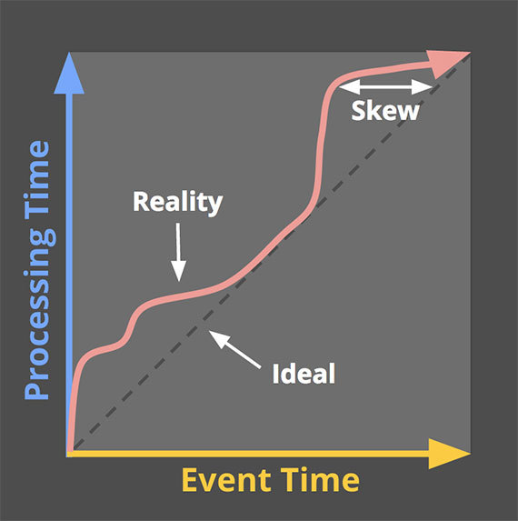
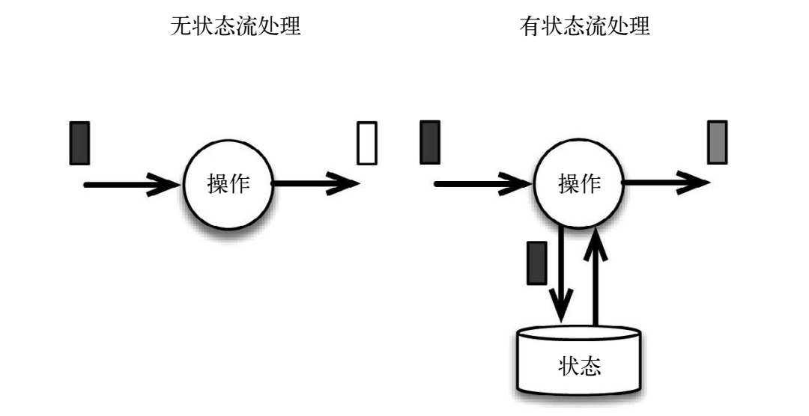

# 流式计算理论与 Flink

## 1 为何选择 Flink

### 为何需要用流数据

如何分析大规模系统中的流数据，尤其是对实时数据进行实时分析，在许多情况下，人们希望用低延迟或者实时的流处理来获得数据的高时效性，前提是流处理本身是准确且高效的。

分析持续生成且永不结束的数据

与其说流数据是特别的，倒不如说它是自然的————只不过从前我们没有流处理的能力，只能做一些特殊的处理才能真正地使用流数据，比如将流数据攒成批量数据再处理，不然无法进行大规模的计算。

需求以及如何满足需求

### 流数据来源：

* 网站获得的能够反映用户行为的点击流数据
* 私有数据中心的机器日志
* 传感器测量
* 金融交易

### 连续事件处理的目标：

* 低延迟
* 高吞吐
* 处理中断，即能使系统在崩溃之后重新启动，并且产出准确的结果（容错并保证 exactly-once）
* 基于事件发生时间
* 处理乱序事件流

### 流处理技术的演变

Lambda 架构：通过批量 MapReduce 作业提供了虽然有些延迟但是结果准确的计算，同时通过 Storm 将最新数据的计算结果初步展示出来。


* MapReduce 作业很难做到低延迟
* Storm 作业不支持 exactly-once 语义，不支持事件时间
* Lambda 架构需要对同样的业务逻辑进行 2 次编程：一次为批量计算的系统，一次为流式计算的系统
* 系统非常难维护

Spark Streaming 微批处理作业：将连续事件中流数据分割成一系列微小的批量作业，如果分割得足够小，计算就几乎可以实现真正的流处理。

* 可以实现 exactly-once 语义
* 和数据到达时间紧密耦合
* 不能根据实际情况分割事件数据，只能根据批量作业时间的倍数进行分割

Flink 同时实现批处理和流处理：将批处理（即处理有限的静态数据）视作一种特殊的流处理。

## 2 流处理架构

典型的传统架构：采用一个去中心化的数据库系统，该系统用于存储事务性数据。数据库拥有准确的数据，反映了当前的业务状态。

消息传输层的理想功能：

* 兼具高性能和持久性
* 将生产者和消费者解耦

数据流作为中心数据源：流处理架构不需要集中式数据库，取而代之的是消息队列，它作为共享数据源，服务于各种不同的消费者。

## 3 Flink 的用途

* 使流处理架构变得完整
* 使应用程序的构建过程符合自然规律

不同类型的正确性

在处理数据时，需要解决这几个问题：

* 我需要什么？
* 我期望什么？
* 我在什么时候需要得到结果？

令 Flink 具有多用途的几个核心特点，特别是它如何保障数据的正确性。

1. 符合产生数据的自然规律：流处理器（尤其是 Flink）的正确性体现在计算窗口的定义符合数据产生的自然规律。
    * 通过点击流量追踪某网站的 3 个访问者的活动，对于每个访问者，活动是不连续的。当采用固定的计算窗口或者微批处理时，很难使计算窗口与会话窗口吻合。
2. 事件时间：为了获得最佳的计算结果，系统需要能够通过数据找到事件发生的时间，而不是只采用处理时间。*（为什么说 Flink 可以区分不同类型的时间，如果事件时间是消息的一个属性，其他流处理框架不能根据这个属性做窗口计算吗）*
3. 发生故障后仍能保持准确（检查点 checkpoint）：如果想使计算保持准确，就必须跟踪计算状态，如果计算框架本身不能做到这一点，就必须由应用程序的开发人员来完成这个任务。在每个检查点，系统都会记录中间计算状态，从而在故障发生时准确的重置。这一方法使系统以低开销的方式拥有流容错能力————当一切正常时，检查点机制对系统的影响非常小。另外检查点也使 Flink 可以按需重新处理数据。 
4. 及时给出所需结果（低延迟）
5. 使开发和运维更轻松：
    * 完备的语义
    * 由框架跟踪计算状态
    * 用同一种技术来实现流处理和批处理

## 4 对时间的处理

### 对比

#### 1. 采用批处理架构和 Lambda 架构计数

组成：


1. 持续摄取数据的管道每小时创建一次文件（HDFS）
2. 由调度程序安排批处理作业（MapReduce）分析最近生成的一个文件（将文件中的事件按 key 分组，计算每个 key 对应的事件数），每小时提供准确的计数
3. 为了尽早获得计数结果，引入 Storm 采集消息流，提供实时近似的计数

存在问题：

1. 太多独立的组成部分
2. 对时间的处理方式不明确：如果需要修改计数的时间窗口，需要修改文件生成逻辑和调度逻辑，而不是应用代码逻辑
3. 乱序事件流：分批无法根据事件时间正确的进行划分，只能根据消息处理时间进行划分
4. 批处理作业的界限不清晰：无法准确的划分窗口，无法处理会话窗口

#### 2. 采用流处理架构计数

组成：

1. Flink 之间从管道采集数据进行处理

``` java
DataStream<LogEvent> stream = env
    // 通过 Kafka 生成数据流
    .addSource(new FlinkKafkaConsumer(...))
    // 分组
    .keyBy("country")
    // 将窗口时间设为 60 分钟
    .timeWindow(Time.minutes(60))
    // 针对每个时间窗口进行操作
    .apply(new CountPerWindowFunction());
```

可以解决上述所有问题。

流处理区别与批处理最主要的 2 点是：

1. 流即是流，不必人为地将它分割成文件
2. 时间的定义被明确写入应用程序代码（如以上代码的时间窗口），而不是与摄取、计算和调度等过程牵扯不清

开发需要考虑的问题：

1. 系统是否可以处理乱序事件流以及不一致的窗口
2. 是否可以在提供准确的聚合结果之外还提供预警
3. 是否可以准确的重播历史数据
4. 系统的性能（低延迟和高吞吐）
5. 发生故障时保证系统持续运行

### 时间概念

1. 事件时间：事件实际发生的时间
2. 处理时间：事件被处理的事件/在系统中观察事件的时间

在现实世界中，会存在 2 个问题：

1. 事件时间与处理时间之间有偏差，而且偏差不可预测
2. 事件时间和处理时间的顺序不一致，意味着晚发生的数据可能被先处理



如果关心计算的正确性和事件实际发生的上下文，则必须基于事件发生的时间做计算，而不是处理时间。

带来的问题：

* 如果要求在事件时间的维度上正确地处理数据，就不能像大多数现有系统那样使用处理时间切割数据。
* 即使想按照事件时间窗口化，在无界数据的情况下，无序和时间上的偏差会带来事件时间的完整性的问题：在缺少处理时间和事件时间之间可预测映射的情况下，如何确定事件时间 X 之前的数据都到了？

### 窗口

窗口是一种机制，它用于将许多事件按照时间或者其他特征分组，从而将每一组作为整体进行分析

1. 时间窗口
    1. 滚动
    ```
    // 1 分钟的滚动窗口
    stream.timeWindow(Time.minutes(1))
    ```
    2. 滑动
    ```
    // 每 30 秒滑动一次的 1 分钟的滑动窗口
    stream.timeWindow(Time.minutes(1), Time.seconds(30))
    ```
2. 计数窗口
    1. 滚动
    ```
    // 4 个元素的计数窗口
    stream.countWindow(4)
    ```
    2. 滑动
    ```
    // 每 2 个元素滑动一次的 4 个元素组成的滑动窗口
    stream.countWindow(4, 2)
    ```
3. 会话窗口：会话指的是活动阶段，其前后都是非活动阶段。在 Flink 中，会话由超时时间设定，即希望等待多久才认为会话已经结束
    ```
    // 如果用户处于非活动状态长达 5 分钟，则认为会话结束
    stream.window(SessionWindows.withGap(Time.minutes(5)))
    ```

#### 触发器

描述窗口内的数据何时（when）被处理且下发的机制，触发器这个机制使得我们能灵活地选择何时计算窗口数据，还能多次触发一个窗口。进一步，这使得我们可以随着时间的推进，用新的或者迟到的数据来修订之前推测的结果。

### 水印 watermarks

水印是嵌在数据流中的常规记录，计算程序通过水印获知某个时间点已到。

基于事件发生的时间判断输入的完整性，如果说当前水印是 10 点，那么「所有的 10 点前的数据都已经被处理了」，因此水印被用来衡量无限数据处理的进度。

收到水印的窗口可以知道不会有早于水印时间的记录还未到达；所有时间小于该水印的事件都已经到达。

水印是由开发人员生成的，这通常需要对响应领域有一定了解。

1. 完美的水印
    1. 非乱序事件流，最近一次事件的时间戳就是完美的水印。
    2. 如果知道事件的迟到时间不会超过 5 秒，就可以将水印标记时间设为收到的最大时间戳减去 5 秒。
2. 启发式水印：估计时间，可能出错
    1. 迟到的事件晚与水印出现
    2. 水印迟到太久，收到结果的速度可能就会很慢；解决方法是在水印到达之前输出近似结果

## 5. 有状态的计算

流式计算分为无状态和有状态 2 种情况：

1. 无状态计算：观察每个独立事件，并根据最后一个事件输出结果
2. 有状态计算：基于多个事件输出结果
    1. 窗口
    2. 用于复杂事件处理的状态机
    3. 流与流之间的关联操作，流与静态表或动态表之间的关联操作



### 一致性（3个级别）

成功处理故障并恢复之后得到的结果，与没有发生任何故障时得到的结果相比，前者有多正确

以对最近一小时登录的用户计数为例，在系统经历故障之后，计数结果

* at-most-once：故障发生之后，计数结果可能丢失
* at-least-once：故障发生后可能重复计算，但是绝不会丢失（在此基础上使应用程序具有幂等性，可以做到 exactly-once）
* exactly-once：系统保证在发生故障后得到的计数结果与正确值一致

保证一致性，需要在性能和表现力之间妥协。无法单独地对每条记录运用应用逻辑，而是同时处理多条（一批）记录，保证对每一批的处理要么全部成功，要么全部失败。这就导致在得到结果前，必须等待一批记录处理结束。


### 检查点：保证 exactly-once

Flink 如果保证 exactly-once，它使用一种被成为「检查点」的特性，在出现故障时将系统重置回正确状态。

检查点是 Flink 最有价值的创新之一，因为它使 Flink 可以保证 exactly-once ，并且不需要牺牲性能。

检查点的核心作用是确保状态正确，即使遇到程序中断，也要正确。


``` scala
val stream: DataStream[(String, Int)] = ...

val counts: DataStream[(String, Int)] = stream
    .keyBy(record => record._1)
    .mapWithState((in: (String, Int), count: Option[Int]) => 
        count match {
            case Some(c) => ( (in._1, c + in._2), Some(c + in._2) )
            case None => ( (in._1, in._2), Some(in._2) )
        }
    )

```


如果检查点操作失败，Flink 会丢弃该检查点并继续正常执行，因为之后的某一个检查点可能会成功。虽然恢复时间可能更长，但是对于状态的保证依旧很有力。只有在一系列连续的检查点操作失败之后，Flink 才会抛出错误，因为这通常预示着发生了严重且持久的错误。


Flink 检查点算法的正式名称是**异步屏障快照**(asynchronous barrier snapshotting)，该算法大致基于 Chandy-Lamport 分布式快照算法。

### 保存点：状态版本控制

检查点由 Flink 自动生成，用来在故障发生时重新处理记录，从而修正状态。Flink 用户还可以通过另一个特性有意识地管理状态版本，这个特性叫做保存点（savepoint）。

保存点与检查点的工作方式完全相同，区别在于检查点由 Flink 自动触发，而保存点由用户手动触发。

* 应用程序代码升级
* Flink 版本更新
* 维护和迁移
* 假设模拟和恢复
* A/B测试

### 端到端的一致性和作为数据库的流处理器

流式计算从外部数据源读取数据，经过算子计算，将状态内容输出到存储系统。

* 存储系统具备「原子提交」的能力，Flink 在 sink 环节缓冲所有输出，在 sink 收到检查点记录时将输出「原子提交」到存储系统
* 直接将数据写入到存储系统，但是要求存储系统可以覆盖数据或者删除数据，Flink 发生错误回滚时重新处理输出的内容

这 2 种方式恰好对应关系型数据库系统中的两种事务隔离级别：

* 已提交读（read committed）
* 未提交读（read uncommitted）


Flink 提供可查询状态特性，对于状态本身就是所需的信息的查询，在这种情况下，Flink 可以有限的代替数据库，而不需要输出状态到存储系统。

### 计算的状态

依靠多个流事件来计算结果，必须讲数据从一个事件保留到下一个事件。这些保存下来的数据叫做计算的状态。

准确处理状态对与计算结果的一致性至关重要。在故障或中断之后能够继续准确地更新状态是容错的关键。

## 6 批处理：一种特殊的流处理

